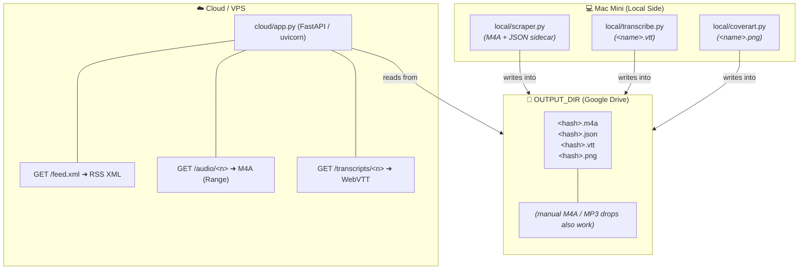
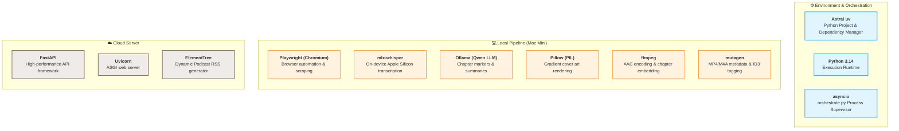

# NotebookLM → Podcast

Two-part system that turns Google NotebookLM "Audio Overviews" into a
personal podcast RSS feed with transcripts:

- [**local/**](local/) — Mac Mini side. Playwright scraper, on-device
  MLX-Whisper transcriber, and Ollama-driven cover-art generator. Writes
  `<hash>.m4a` / `.json` / `.vtt` / `.png` quartets into a
  Google-Drive-synced folder (`OUTPUT_DIR`).
- [**cloud/**](cloud/) — Wherever you can publish. FastAPI app that reads
  the same folder (synced down to the cloud box via Google Drive), generates
  the RSS feed on the fly, streams M4As to podcast clients with HTTP
  Range support, and serves WebVTT transcripts via the Podcasting 2.0
  `<podcast:transcript>` tag.



## Technology Stack & Frameworks

The pipeline is powered by a modern, high-performance Python stack:




Both halves are independent uv-managed Python 3.14 projects. Each has its
own `pyproject.toml`, `.env.example`, and `README.md`. Deploy them
separately, or run them together via the top-level orchestrator
(see [Running both halves together](#running-both-halves-together)).

## Quick start

Install [uv](https://docs.astral.sh/uv/) once:

```bash
curl -LsSf https://astral.sh/uv/install.sh | sh
```

### Local (scraper + transcriber)

```bash
cd local
uv sync
uv run playwright install chromium
cp .env.example .env                   # set OUTPUT_DIR (+ optional OLLAMA_BASE_URL for cover art)
uv run scraper.py --login              # one-time Google sign-in (headful)
uv run scraper.py                      # main entry point
```

See [local/README.md](local/README.md) for all commands and the launchd recipe.

### Cloud (FastAPI feed server)

```bash
cd cloud
uv sync
cp .env.example .env                   # set OUTPUT_DIR and FEED_BASE_URL
uv run uvicorn app:app --host 0.0.0.0 --port 8000
```

Subscribe podcast clients to `${FEED_BASE_URL}/feed.xml`. See
[cloud/README.md](cloud/README.md) for endpoint details and reverse-proxy
notes.

## Running both halves together

When both halves live on the same host (typical Mac Mini setup where the
cloud app is exposed via Tailscale Serve or Cloudflare Tunnel), the
top-level [orchestrate.py](orchestrate.py) supervises both as one process
tree using stdlib `asyncio` — no extra dependencies, no root `.env`:

```bash
python3 orchestrate.py
```

- Starts the cloud FastAPI/uvicorn server and keeps it running, restarting
  it on crash with a short backoff.
- Runs `scraper.py` once at startup, then again every
  `SCRAPE_INTERVAL_S` seconds (default `3600`, i.e. once an hour).
  Sequential only — a slow scrape never overlaps with the next one.
- Merges both children's logs into one stream, prefixed `[cloud]` /
  `[scraper]`, so launchd/systemd just sees one stdout.
- SIGINT/SIGTERM cleanly terminates both children (10 s grace, then
  SIGKILL).

Both children are spawned via `uv run …` inside `local/` and `cloud/`
respectively, so each picks up its own `.env` exactly as if you'd run it
by hand. Optional environment knobs (read from the orchestrator's own
environment — there is intentionally no root `.env`):

| Variable | Default | Purpose |
|---|---|---|
| `SCRAPE_INTERVAL_S` | `3600` | Seconds between scraper runs |
| `CLOUD_HOST` | `0.0.0.0` | uvicorn bind host |
| `CLOUD_PORT` | `8000` | uvicorn bind port |
| `CLOUD_RESTART_DELAY_S` | `5` | Backoff before restarting the cloud app after a crash |

Example launchd plist snippet (writes combined logs to a single file):

```xml
<key>ProgramArguments</key>
<array>
  <string>/usr/bin/python3</string>
  <string>/Users/you/notebooklm_scraper/orchestrate.py</string>
</array>
<key>WorkingDirectory</key>
<string>/Users/you/notebooklm_scraper</string>
<key>KeepAlive</key><true/>
<key>StandardOutPath</key><string>/Users/you/notebooklm_scraper/orchestrate.log</string>
<key>StandardErrorPath</key><string>/Users/you/notebooklm_scraper/orchestrate.log</string>
```

## Configuration shared between halves

Both halves need their own `.env` files, but the only setting that must
agree between them is **`OUTPUT_DIR`** — both must resolve to the same
synced Google Drive folder. Everything else (Whisper / Ollama settings on
local, RSS metadata on cloud) is one-sided.

## Data model

Each scraped episode produces this set of sibling files in `OUTPUT_DIR`:

- **`<hash>.m4a`** — the Audio Overview download.
- **`<hash>.json`** — metadata: title, description, pub_date, source notebook id/URL.
- **`<hash>.vtt`** — WebVTT transcript (added by the transcribe pass).
- **`<hash>.png`** — cover art themed by the description (added by the cover-art pass).

`<hash>` is `md5(normalized_description)` so regeneration of the same
NotebookLM content is idempotent.

If a bare `.m4a` or `.mp3` is dropped into `OUTPUT_DIR` with no sidecar JSON, the
cloud feed synthesises a minimal episode from the filename + mtime so the
file still shows up.

## Notes / gotchas

- The Playwright user-data dir defaults to `local/playwright_profile/`,
  **not** your real Chrome `Profile 1`. Chrome locks its own profile while
  running, which breaks Playwright. If you want to point at a real Chrome
  profile, close Chrome first and set `USER_DATA_DIR` in `local/.env`.
- NotebookLM's DOM changes regularly. Selectors live in
  [local/scraper.py](local/scraper.py) in `extract_description()` and
  `download_audio_overview()` — adjust there if Google rearranges things.
- Idempotency is keyed on the **description text hash**. If Google
  regenerates the overview with new text, you'll get a new episode
  (intended).
- The cloud app generates the feed per request — no `feed.xml` is written
  to `OUTPUT_DIR` anymore.
